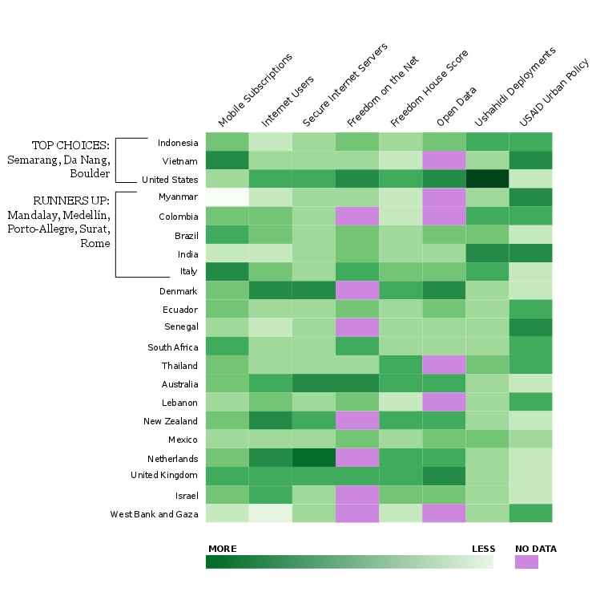

RNI_select
==========
This is my very first R code: a heatmap visualization for RNI city selection. Lacking specific, city-level data, I turned to national level data (sources below) to give me a feel for what these indicators _might_ look like in the cities that are currently on the [Rockefeller short-list](100resilientcities.rockefellerfoundation.org). The goal for creating this repo is to:
* Start playing with R.
* Learn the Github workflow for better Pirate/Ninja collaboration in the future.
* Look cool.

The [R code](/heatmap.r) was taken from the [Flowing Data tutorial](http://flowingdata.com/2010/01/21/how-to-make-a-heatmap-a-quick-and-easy-solution/) and I used [auremoser's Pirateplotr repo](https://github.com/auremoser/pirateplotr) as a template to set up a sensible (I hope) repo of my own.

## Output
The [R code](/heatmap.r) creates the following output: 

 

I did a quick bit of finishing work in [Inkscape](http://www.inkscape.org/en/), including rotating the chart to reverse the order of observations and place them on the left. I hand-colored null values (note below) and added a few lables to get the following: 

 

## Key / Data sources
The [.csv](/data/RNI.csv) contains data from:
* Mobile cellular subscriptions (per 100 people): [World Bank Development Indicators](http://data.worldbank.org/indicator/IT.CEL.SETS.P2). 
* Internet users (per 100 people): [World Bank Development Indicators](http://data.worldbank.org/indicator/IT.NET.USER.P2)
* Secure Internet servers (per 1 million people) [World Bank Development Indicators](http://data.worldbank.org/indicator/IT.NET.SECR.P6) 
* Freedom on the Net: [Freedom House](http://freedomhouse.org/report/freedom-net-2013-global-scores#.UwqKBfldVEI) 
* Freedom House Freedom Score: [Freedom House](http://www.freedomhouse.org/report/freedom-world/freedom-world-2013#.Uw5RtvldVEL) 
* Open Data (OKFN Rank): [Open Knowledge Foundation](https://index.okfn.org/country) 
* Ushahidi Deployments: National level: [Ushahidi, internal list](https://docs.google.com/spreadsheet/ccc?key=0AikmHjO1VwoddEV2VGZxTHh1UE1YaGhtOG41ekhyTUE&usp=drive_web#gid=2) 
* USAID Urban Policy (priority level): [USAID](http://www.usaid.gov/sites/default/files/documents/1870/USAIDSustainableUrbanServicesPolicy.pdf) 

## Data processing notes:
I used inverse transformation to standardize higher numbers as "more" or "better" across all data sets. The three data sets that required the transformation were Freedom on the Net, Freedom House, and OKFN. For USAID, I simply reversed the range of values since the scale was 0-4.

### Note regarding null values
I had a few null values in the matrix that I simply converted to 0 since I wasn't sure how to make R ignore certain cells or values. When I created the final graphic I manually changed the color of these cells in Inkscape. The list of countries: variables with null values is:
* Colombia: Freedom on net, OKFN
* Denmark: Freedom on the net
* Israel: freedom on the net
* Lebanon: OKFN
* Myanmar: OKFN
* Netherlands: Freedom on the net
* New Zealand: Freedom on the net
* Senegal: Freedom on the net
* Thailand: OKFN
* Vietnam: OKFN
* WB/G: Freedom on net, OKFN

